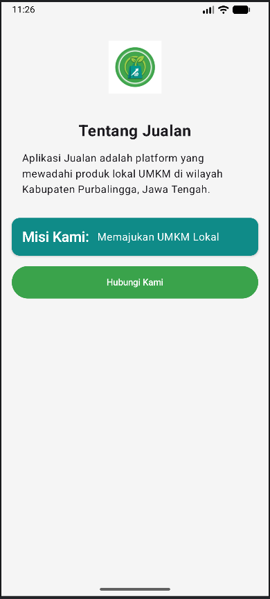
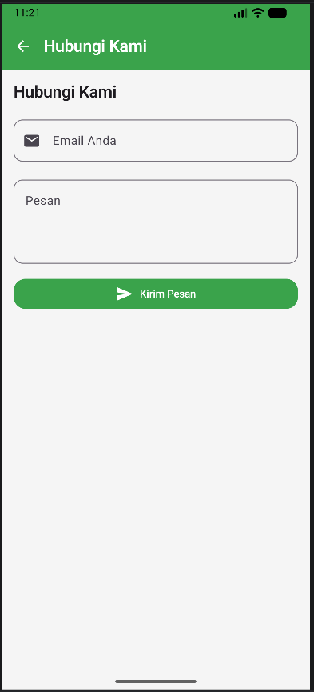

# Identitas Praktikan
- **Nama:** Hana Naila Rahmadina
- **NIM:** H1D024093
- **Shift KRS:** Shift D
- **Shift Sekarang:** Shift I

## Hasil Praktikum 2

Pada praktikum 2 ini, saya belajar mengatur warna dan ukuran huruf pada aplikasi menggunakan fitur Material Design 3, membuat dua halaman berbeda yang bisa saling terhubung saat tombolnya diclick, dan membuat kotak isian untuk mengirim pesan dan menambahkan notifikasi kecil yang muncul di bagian bawah layar.

## Hasil Praktikum 3

https://github.com/user-attachments/assets/92910c7c-4321-4e7d-ba22-3ba5906b4b52

Pada praktikum pertemuan 3 ini, saya belajar membuat *Dynamic Lists* dan *Lazy Layouts* menggunakan Jetpack Compose. Hal yang diterapkan meliputi:
- Pembuatan `Data Class` dan data *dummy* untuk Kategori dan Produk.
- Implementasi `LazyRow` untuk daftar kategori yang bisa digeser mendatar.
- Implementasi `LazyVerticalGrid` untuk daftar produk dalam format *grid* 2 kolom yang hemat memori.
- Menambahkan fungsi *filter* interaktif sehingga produk yang tampil menyesuaikan kategori yang diklik pengguna.
- Pratinjau aplikasi dalam mode terang (*Light*) dan gelap (*Dark*).

## Hasil Praktikum 4

https://github.com/user-attachments/assets/7f8ac818-093e-4def-ac0b-e153bd3c509c

Pada praktikum 4 ini, saya belajar mengelola status data (State) pada aplikasi agar tampilannya bisa berubah secara otomatis saat ada interaksi (Recomposition). Saya memisahkan logika data dari desain tampilan menggunakan teknik State Hoisting. Selain itu, saya juga mempraktikkan cara membuat simulasi loading secara asinkron agar aplikasi tidak berhenti mendadak (freeze), melakukan validasi untuk form input yang lebih rumit, serta mengatur navigasi dan perpindahan antar layar aplikasi.

## Hasil Praktikum 5

https://github.com/user-attachments/assets/4d98101f-510b-4734-a2a5-2b24b761f0c5

Pada praktikum 5 ini, saya belajar mengimplementasikan arsitektur jaringan (Networking) dan pola arsitektur MVVM. Saya menggunakan library Retrofit dan Gson untuk mengambil data API berformat JSON secara dinamis dari server, serta memakai library Coil untuk merender gambar dari internet secara asinkron. Selain itu, saya juga memisahkan logika pemrosesan data ke dalam ViewModel dan mengelola status pemuatan data (Loading, Success, dan Error) di latar belakang menggunakan antarmuka StateFlow agar aplikasi tidak mengalami freeze.
